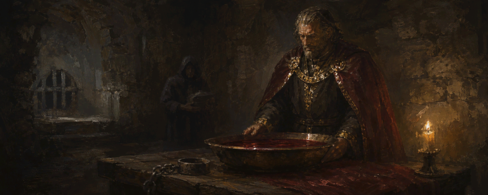
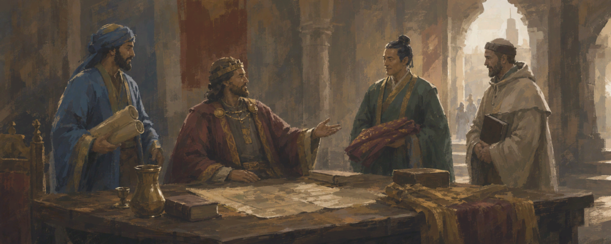
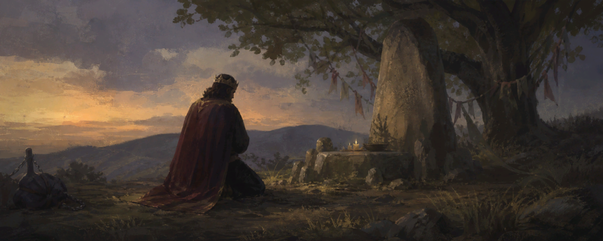
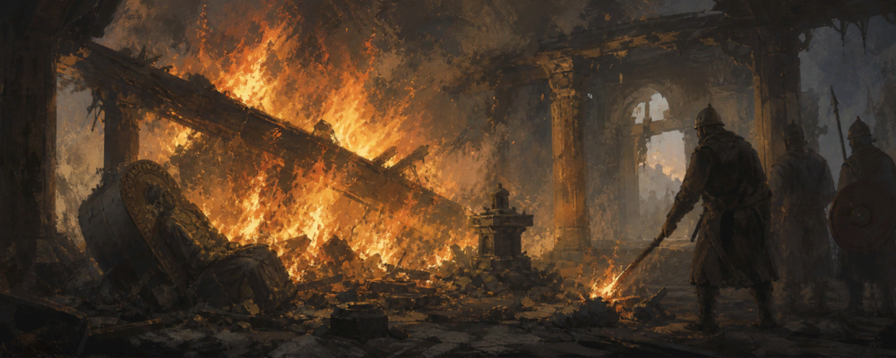

# CK3 Mods

Three mods for Crusader Kings III 1.19.

## the-crimson-bath

> Behind sealed doors in the deepest cellar of your keep, the old rite is prepared. Captives, dragged from your dungeons, are bound to the iron table in turn; the basin beneath fills slowly. You drink, and you wash, and somewhere in the long hour the ache in your bones begins to ease. By dawn you are someone younger. The servants who clean the chamber do not meet your eye.

**Cheat the years.** When age starts taking your ruler apart, trade prisoners for time. Each old-age malady (infirm, clouded eyes, faltering heart, fragile bones, withering mind) is undone by one captive under thirty. The rite plays out one captive per screen, with malady-specific flavor, so each kill lands. Five-year cooldown.

**Consequences.**

- The doer is branded a witch and gains stress.
- Every close family member of each sacrificed captive carries a -50 grief opinion against you for fifteen years; the penalty stacks if you take more than one of their blood.
- A whispered nickname if you have none: the Vampire, the Strigoi, the Pale, the Red, or the Undying.
- Sadistic rulers see extra flavor at each kill; callous or sadistic rulers recover small stress per captive.
- On faiths without ritual sacrifice, each kill carries a 10% chance to leave you callous, with stress relief and a short coda screen.

## eclectic-traditions

> This people gather wisdom from every road that crosses their lands. Foreign sages are welcomed at the high table; merchants are pressed for stories of distant rites; the children grow up speaking of customs their grandparents would have called heresy. No single way is held above all others, and so all ways are theirs to keep.

**A culture that learns from everyone.** Eclectic Traditions raises your tradition cap by 20 and accelerates cultural acceptance gain by 10%, freeing you from the usual "pick three traditions and live with it" squeeze. An independent ruler takes it by the *Open the Hall to Foreign Customs* decision (1000 gold, 2000 prestige, 1000 piety). The decision opens an event window with a "Close the doors" back-out that refunds the cost in full if you have second thoughts.

**Consequences.** Not everyone in your court is glad to see foreigners at the high table. Every direct vassal of your culture takes a -15 opinion penalty against you for five years. The most prominent same-culture traditionalist (`zealous`, `stubborn`, or `paranoid`), preferring vassals over courtiers, becomes your rival.

## vigil-at-the-holy-site

> You set aside the cares of rule for the divine. A captive from your dungeons is given over to the rites your faith demands. When you return, the world is unchanged but you are not.

**A piety pump with character.** Reforming or creating a faith stalls on piety income. The Vigil hands you 5000 piety in one go, with no kingdom requirement and no waiting for fervor to settle, but it costs more than gold: a once-per-game decision plays out across three screens of real choice.

1. **Choose your officiant.** Yourself (stress), your court chaplain (50 gold passed to them; stress only if you are greedy), or a captured priest of a hostile faith (chance to gain sadistic or arbitrary; stress relief if you already are). The captive-priest option requires the captive to hold the court chaplain post, rule a theocracy, or carry the theologian, devoted, saint, or witch trait.
2. **Pick the captive.** If you hold more than one captive young enough, choose between two. The rite is faith-flavored: Norse harrow, Christian pyre, Islamic blade, Tengri peak, or generic altar.
3. **Read the omens.** The officiant's Learning weights a four-tier contest. Best case: a five-year blessing modifier, +3 fervor to your faith, and any active murder scheme against you is exposed. Worst case: a three-year dark-omens modifier and a paranoid-trait risk on the officiant.

### Burn the Infidel Holy Place

**Take the fight to their gods.** After the Vigil, a second decision unlocks. While your army stands on a holy site of another faith that you hold by right, hold by siege, or have just raided, you may burn it. The act grants another 5000 piety and leaves the county under a Desecrated Ground modifier for eighty years (-100% tax, -50% levy).

**Consequences.** An act like this does not go unanswered. The faith of the desecrated holy place takes notice. From your vassals and neighboring rulers of that faith, existing rivals are preferred:

- The most cunning becomes your rival and starts a murder scheme against you.
- The strongest landed becomes your rival and declares a Punitive War. The wargoal is your captivity: on their victory, you are dragged in chains to their dungeon. If the holy place lay inside your own realm, the war also strips its de jure duchy from you on your defeat.
- If the same character takes both roles, they plot and war at once.
